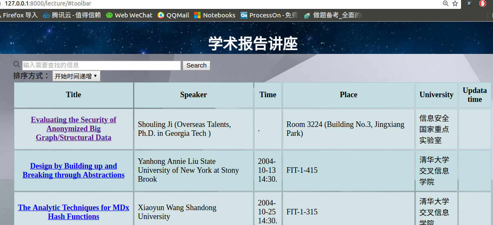
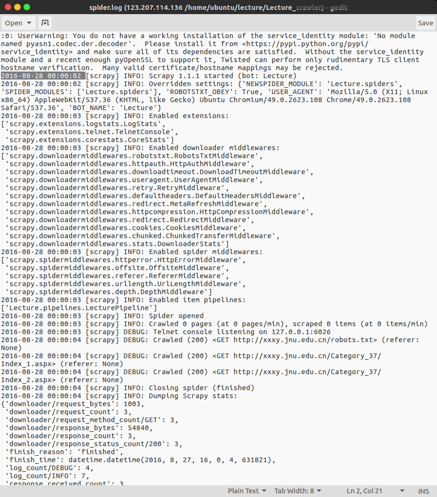

# Overview
 >Environment: Ubuntu16.04 + Python2.7 + Scrapy 1.2.0 + Django 1.10.4

此项目使用了爬虫框架：Scrapy; ./Lecture_crawler/ 文件夹下即是一个scrapy的文件目录。  
其余文件是后台框架：Django的文件目录。   
运行本项目务必安装好上述两个框架。

# 项目需求
1. 抓取与信息安全, 密码学相关的学术报告信息。  
2. 显示讲座标题, 报告人, 时间, 地点, 大学, 通知全文链接。  
3. 至少提供2种时间排序方式, 其一, 按照报告举行时间由近及元排序; 其二, 按照通知发布时间由近及元排序.。   
4. 可以增加新的网站网址。   
5. 自动更新    

## 分析：    
系统需要通过爬虫爬去要求的学术报告信息，存取到数据库中，在通过一种方式展示。结合实训对实用性的要求，我们最终选择了网页的展示方式。
由于每个网站都需要对应的爬虫，所以不可能实现随意增加新网站。
实现功能：爬取信息，自动更新信息，筛选信息，对时间排序，网页的交互。

# Django 
 运行 `python manage.py runserver`   
 默认启动在 http://127.0.0.1:8000/lecture  
   
展示存在lecture.db中的数据。admin界面的账户为admin 密码 123456   
交互方面：通过ajax与后台交互获取数据。异步更新使交互体验更加流畅。

# 爬虫
爬虫位于./Lecture_crawler/Lecture/spiders/   
编写了6个爬虫来爬取6个网站的学术讲座信息,文件对应关系：
| 文件名       | 对应学校  |  网址  |
| :--------  | :-----  | :---- |
|` ScutSoftware.py`         | 华工软件学院      |    http://www.scut.edu.cn/sse/    |
| `scutCS.py `       | 华工计算机学院      |   http://www.scut.edu.cn/cs/    |
|` jnuISAT.py  `     | 暨南大学信息学院      |    http://xxxy.jnu.edu.cn/   |
| `scauCOI.py  `     |  华南农业大学信息学院    |    http://www.scau.edu.cn/   |
| `SKLOIS.py `      |  信息安全国家重点实验室     |    http://sklois.iie.cas.cn/   |
| `tshIIIS.py`       |  清华大学交叉信息学院    |    http://www.scau.edu.cn/   |

推荐阅读 *ScutSoftware.py*  
*注意，不排除网页改版导致上述爬虫失效*

## 增量爬取
采用的是将url保存下来，需要重新爬取的时候将改url与保存的url进行比较，在已保存的url中则跳过爬取。简单来说，就是使用url和Python中set集合的性质实现增量。   
由于本实训数据量较小，所以以上方法也是可行的，但是对于要爬取大量网页而言，明显保存这么多url不现实。较好的方法是采用布隆过滤器：

>布隆过滤器（Bloom Filter）是1970年由布隆提出的。它实际上是一个很长的二进制向量和一系列随机映射函数。布隆过滤器可以用于检索一个元素是否在一个集合中。它的优点是空间效率和查询时间都远远超过一般的算法，缺点是有一定的误识别率和删除困难。
相比于其它的数据结构，布隆过滤器在空间和时间方面都有巨大的优势。布隆过滤器存储空间和插入/查询时间都是常数。另外, Hash函数相互之间没有关系，方便由硬件并行实现。布隆过滤器不需要存储元素本身，在某些对保密要求非常严格的场合有优势。
布隆过滤器可以表示全集，其它任何数据结构都不能；

相对来说使用布隆过滤器肯定会更好，但是本实训数据量真的很少，所以用简单的set集合性质反而会更高效。

## 数据库

* 本系统属于轻量级系统，讲座信息数据量不大，故经过调查比较当下热门的数据库后，选择轻量级数据库sqlite3。
    > SQLite 是一个类似Access的轻量级数据库系统，但是更小、更快、容量更大，并发更高。 oracle、MySQL、SQLServer 也都是非常优秀的 DBS，只不过他们设计目标不同，特性不同，所以只有更适用某个应用场景，没有绝对的好坏之分。   
    > SQLite 特点如下：  
    > 1. 数据量不超过10万
    > 2. 日页面访问量不超过10万 
    > 3. 一部分网站全部生成静态页面，一部分网站实时查询数据库动态访问  
    >
    >
    >SQLite 的优点在中小网站CMS应用场景下表现突出：
    >1. 与MySQL相比，它更彻底的免费，并且没有任何使用上的限制 
    >2. 非常小巧，PHP5以上版本中无需任何配置即可支持SQLite 
    >3、无需单独购买数据库服务，无服务器进程，配置成本为零
    >4. 整个数据库存储在一个单个的文件中，数据导入导出备份恢复都是复制文件，维护难度为零
    >5. 读速度快，在数据量不是很大的情况下速度较快，更重要的是：省掉了一次数据库远程链接没有复杂的权限验证，打开就能操作

    综合上述资料，本项目选取sqlite3会有更好的性能。   
* 数据类型的选取。由于需求中有对时间排序的需求，而在不同的网站中时间的格式不统一，为了排序必须统一格式，最后选取了存为datetime,牺牲了部分讲座的结束时间和连续开几天的讲座的信息 如http://www2.scut.edu.cn/s/87/t/431/ec/0c/info125964.htm此为丢失的讲座信息
* 主键：主键采取link + title的复合主键。一开始采取网址为主键，后来发现有的链接中有多个信息故改为复合主键。

## 自动更新
一开始考虑提供按钮点击直接在后台运行爬虫。当考虑到可行性如果网页同时有多人点击那个按钮可能会导致网站崩溃，所以最终采取每天零时自动通过脚本文件运行爬虫。   
具体设置可以参考[这里](https://blog.csdn.net/solo_ws/article/details/52337393)。   
脚本为`cron.sh`

